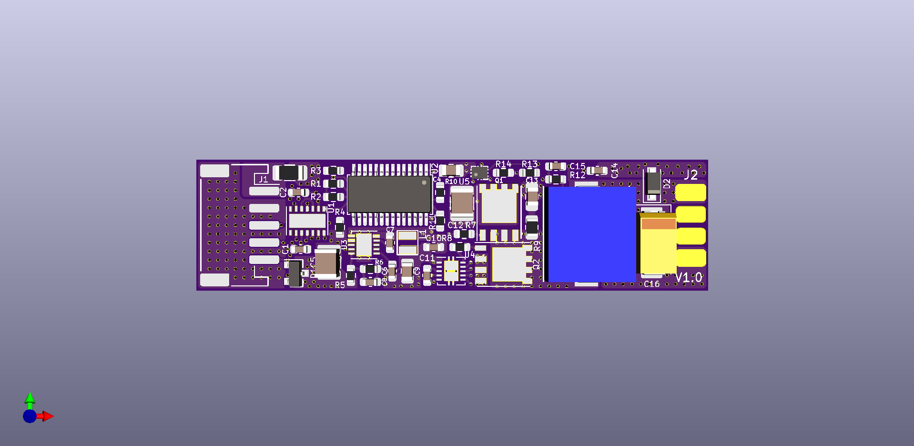

# ledCAN
A multipurpose buck converter with CAN interface.


## Clone the project
This project work with M0A21BSP submodule from Nuvoton corporation. You need to initialize submodules by passing ``--recurse-submodules`` to the ``git clone`` command.
```
git clone https://github.com/MIH-pi/ledCAN.git --recurse-submodules
```

## Credits
We are thankful that Nuvoton corporation (MCU),PANJIT (MOSFET), Texas Instruments (CAN SBC) provid samples and technical support.
<www.nuvoton.com>
<www.panjit.com.tw>
<ti.com>
